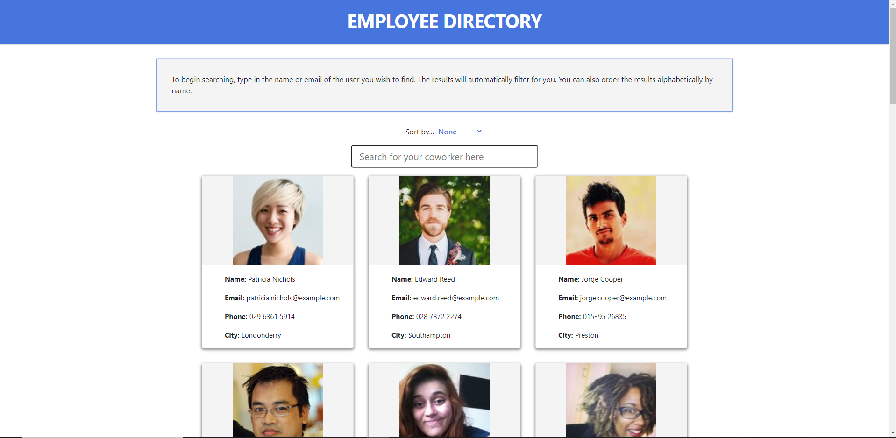

# employee-directory
A directory of employees displayed as a whole, though filterable by name, email and city.

It was created to enable employers to see data on their employees quickly.

## Contents
Section | Description
------------ | -------------
[Screenshot](#screenshot) | Screenshots of the Employee Directory and a link to the repo.
[Functionality](#functionality) | Information on the functionality of the Employee Directory.
[Licence](#licence) | Licence for the source code

## Screenshot

You can access the Employee Directory [here](https://kvtemadden-employee-directory.herokuapp.com/)

You can access the GitHub Repo via [this link](https://github.com/kvtemadden/employee-directory)

## Functionality
The employee directory generates a number of employees so that an employer can see all of their employees and their contact information quickly.

The directory can be quite large, so is filterable by using a search function.

When someone begins typing, any employees who have the same information in their name, email or city will filter.

The contents are also able to be ordered by name, either by A-Z or Z-A.

## Licence
> This site was created under the standard MIT licence.

